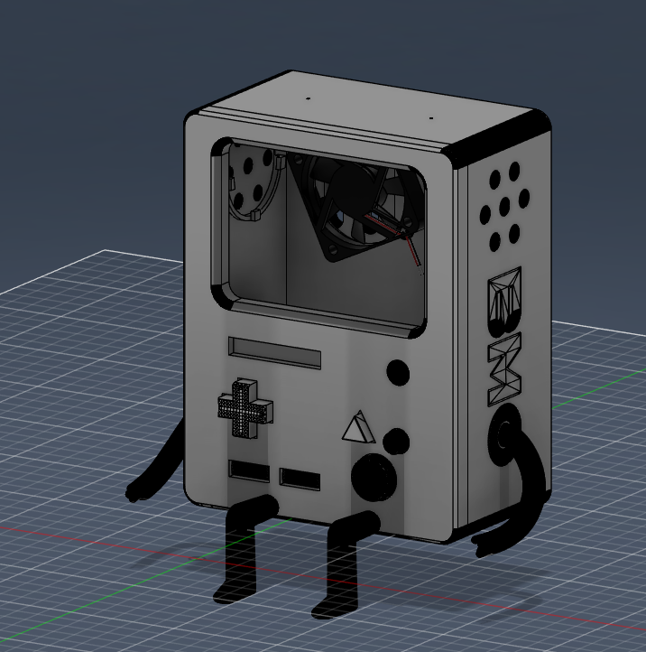
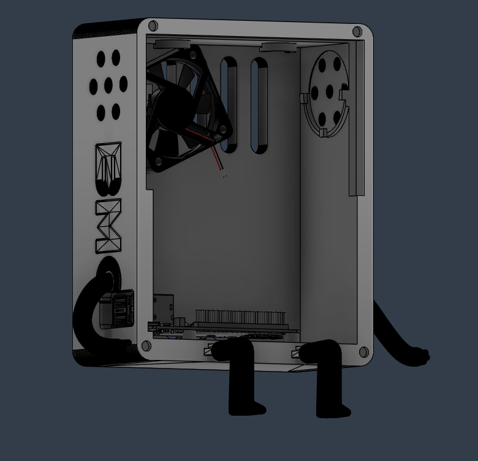

# BMO Assistant

A fully functional, physical AI companion inspired by *Adventure Time*. This project runs on a **Raspberry Pi 5** and integrates LLMs, computer vision, and home automation.

---

## Index
* [Overview](#-overview)
* [Features](#-features)
* [Tech Stack](#-tech-stack)
* [Hardware Requirements](#-hardware-requirements)

---

## Overview
BMO Assistant is more than just a script; it's a standalone robot that uses a local Large Language Model (LLM) to interact with its environment. It features a reactive GUI that responds to speech and can control your home through Home Assistant integration.

---

## Features
* **Dynamic GUI**: 60 FPS animations with state-machine logic for blinking and talking.
* **Local Intelligence**: Uses **Ollama** for private, offline conversations.
* **Voice Interaction**: 
    * **Wake Word Detection**: Hands-free activation by saying "BMO".
    * **Neural TTS**: High-speed offline voice synthesis using **Piper**.
* **Home Automation**: Direct integration with **Home Assistant** to control IoT devices via natural language.

---

# Tech Stack
* **Language**: Python 3.10+
* **GUI Framework**: Pygame
* **AI Model**: Ollama (Llama 3.2)
* **Speech-to-Text**: SpeechRecognition
* **Text-to-Speech**: Piper TTS

---

## 🔌 Hardware Requirements
| Component | Qty | Price [€] | Link | Status |
| :--- | :---: | :---: | :--- | :---: |
| **Raspberry Pi 5 8Gb** | 1 | 137,32 | [Aliexpress](https://it.aliexpress.com/item/1005006268136678.html) |
| **Raspberry AI Hat+ 13 TOPS** | 1 | 97,69 | [Aliexpress](https://it.aliexpress.com/item/1005008016663902.html) |
| **5' TouchScreen** | 1 | 17,28 | [Aliexpress](https://it.aliexpress.com/item/1005005777123509.html) |
| **Rasberry power supply (5V 5A)** | 1 | 17,44 | [Aliexpress](https://it.aliexpress.com/item/1005006151216642.html) |
| **Speaker Amplifier** | 1 | 13,19 | [Aliexpress](https://it.aliexpress.com/item/1005009241769734.html) |
| **Screws and Heat Inserts** | 1 | 12,27 | [Aliexpress](https://it.aliexpress.com/item/1005007830491580.html) |
| **RPi5 Active Cooler** | 1 | 3,66 | [Aliexpress](https://it.aliexpress.com/item/1005007369671225.html) |
| **Speakers** | 2 | 2,91 | [Aliexpress](https://it.aliexpress.com/item/1005003986255449.html) |
| **64/128Gb SD Card** | 1 | 2,11 | [Aliexpress](https://it.aliexpress.com/item/1005009903743506.html) |
| **GPIO Extenders** | 1 | 1,76 | [Aliexpress](https://it.aliexpress.com/item/1005001467856634.html) |
| **Microphone** | 2 | 0,87 | [Aliexpress](https://it.aliexpress.com/item/1005006740892303.html) |
| **Magnets** | 10 | 0,87 | [Aliexpress](https://it.aliexpress.com/item/1005010053445637.html) |
| **5010 Fan** | 1 | 0,87 | [Aliexpress](https://it.aliexpress.com/item/1005006306536871.html) |
| **Dupont Cables** | --- | 0,87 | [Aliexpress](https://it.aliexpress.com/item/1005003269498051.html) |
| **Microbuttons** | 6 | 0,87 | [Aliexpress](https://it.aliexpress.com/item/1005003985634160.html) |
| **Total Price** | | **~309,98 €** | | |

## Images
Full Assembly

Internals

Designed by: Davide Bonazza